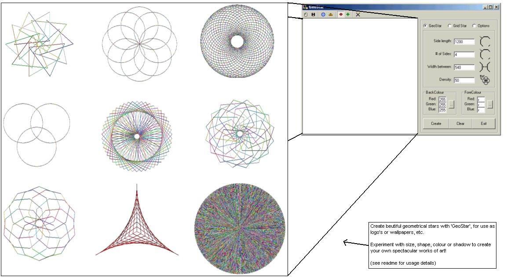



## GeoStar 2\.0

### Description

GeoStar is a powerful tool used to construct spectacular geometrical stars.

Experiment with size, shape, shadow and colour to create your own mind-boggling masterpiece, then export it as a bitmap and use it as a logo or wallpaper, etc.

Comments, suggestions and a vote would be much appreciated.
 
### More Info
 

             |
---                |---
**Submitted On**   |2001-10-01 08:40:42
**By**             |[Chris O'Hara](https://github.com/Planet-Source-Code/PSCIndex/blob/master/ByAuthor/chris-o-hara.md)
**Level**          |Intermediate
**User Rating**    |4.9 (44 globes from 9 users)
**Compatibility**  |VB 5\.0, VB 6\.0
**Category**       |[Graphics](https://github.com/Planet-Source-Code/PSCIndex/blob/master/ByCategory/graphics__1-46.md)
**World**          |[Visual Basic](https://github.com/Planet-Source-Code/PSCIndex/blob/master/ByWorld/visual-basic.md)
**Archive File**   |[GeoStar 2\_274261032001\.zip](https://github.com/Planet-Source-Code/chris-o-hara-geostar-2-0__1-27748/archive/master.zip)

